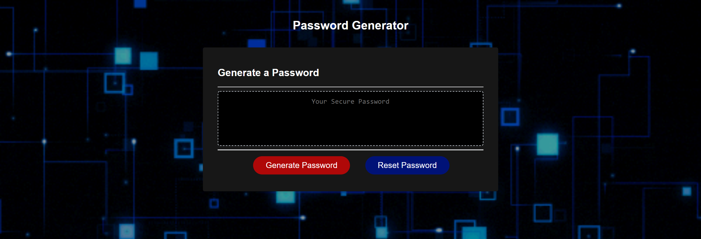

# Password_Generator
# Description
This Password Generator features my skillset in JavaScript by applying a chain of functions to generate a randomized, unsolvable password. When selecting the "Generate Password" button, a series of prompts and confirmations should allow the user to select the character types they wish to be applied within their randomized generated password. The user can also decide to reset their password by selecting the "Reset Password" button, in which they can go through the series of confirmations again to generate a new password. I was also able to utulize some of my skillset with CSS by giving the application a stylish technological interface.

## Table of Contents

* [License](#license)
* [Contributing](#contributing)
* [Screenshot](#screenshot)
* [Questions](#questions)
* [Link](#link)

## License

MIT

## Contributing

Ianaac27

# Screenshot
Here is a mock of the Password Generator.

# Link
Take a look at the live version [here.](https://ianaac27.github.io/Password_Generator/)

## Questions

If you have any questions, please refer to my contact information below.

[GitHub: Ianaac27](https://www.github.com/Ianaac27)

Email: ian.fleshmancooper@gmail.com

